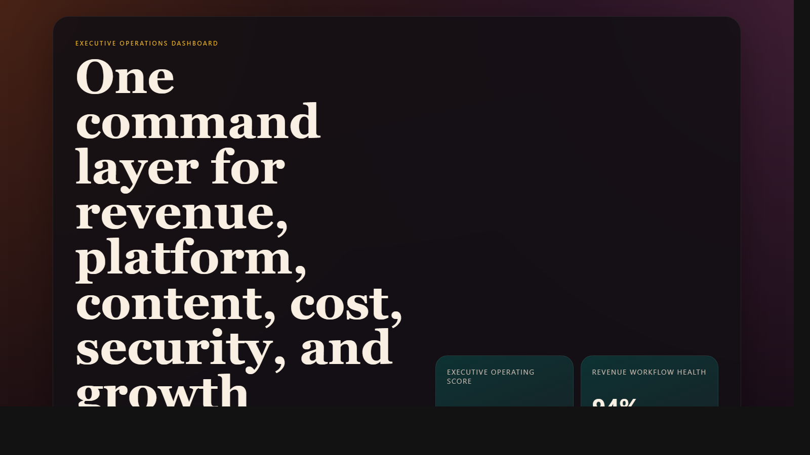
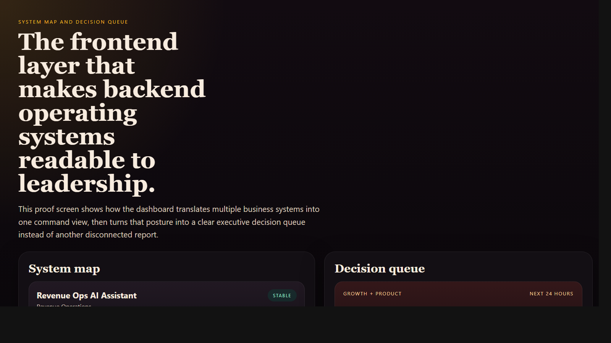
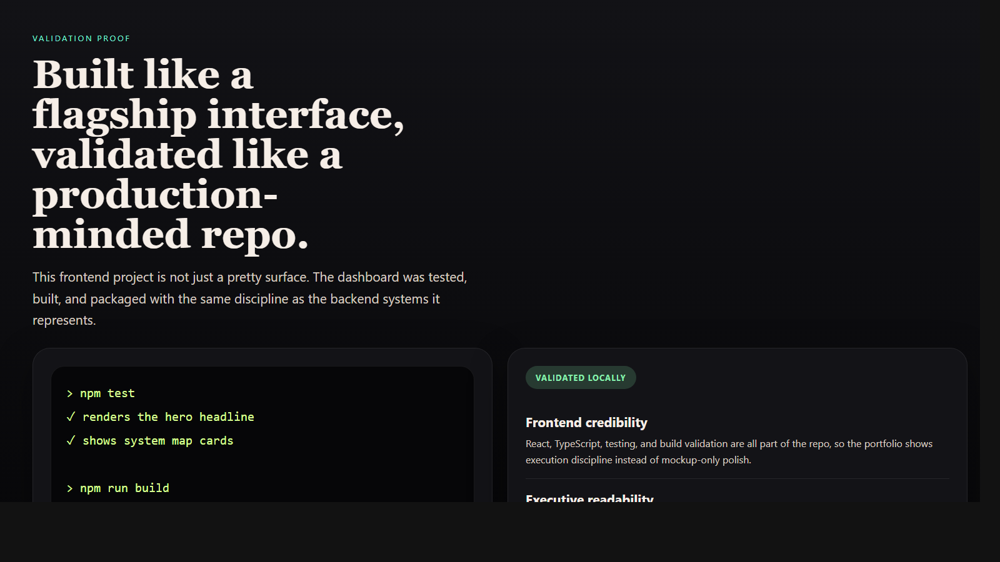

# Executive Operations Dashboard

> **React + TypeScript portfolio project** demonstrating executive operating dashboards, unified business-system visibility, and frontend storytelling that turns revenue, platform, content, security, and growth signals into one premium command surface.

**Recruiter takeaway:** *"This person can do more than build APIs. They can translate complex operational systems into a high-signal product experience executives would actually use."*

---

## Project Overview

| Attribute | Detail |
|---|---|
| **Frontend Stack** | React 19 + Vite + TypeScript |
| **Design Direction** | Editorial executive dashboard, not a generic admin template |
| **Portfolio Role** | Visual flagship that unifies the backend systems in this GitHub portfolio |
| **Signal Areas** | Revenue ops · cloud cost · incidents · content ops · security · growth |
| **Primary Audience** | Executive leadership, platform teams, GTM operations, and web leadership |
| **Validation** | Vitest + Testing Library |

---

## Executive Summary

Executive Operations Dashboard is the frontend command layer for the systems represented across this portfolio. Instead of showing disconnected charts, it translates multiple business and technical systems into one readable executive operating surface: what is stable, what needs attention, what should move next, and why it matters.

The result is a recruiter-facing frontend project that feels like a real internal product used by leadership, platform, marketing, and operations teams to coordinate execution.

---

## Business Problem

Most organizations do not suffer from a lack of dashboards. They suffer from too many dashboards, too many owners, and too little operational synthesis. Revenue, incident response, content governance, cloud cost, security controls, and experimentation often live in separate tools, making it hard for leadership to see pressure, priorities, and decision paths in one place.

---

## Solution

This dashboard acts like an executive command layer. It consolidates:

- system posture across multiple operating domains
- immediate decision queues for leadership attention
- weekly narrative framing around detection, coordination, and reporting
- proof that the builder can connect technical systems to business decisions through interface design

---

## Architecture

```text
Portfolio systems and operating signals
    |
    v
Static TypeScript data model
    |
    v
React application shell
    |
    +--> Executive command signals
    +--> System map
    +--> Decision queue
    +--> Operating cadence
    +--> Capability proof layer
```

### Experience Workflow

1. Leadership lands on the dashboard and sees the highest-signal executive metrics first.
2. The system map translates technical services into business-readable posture.
3. The decision queue clarifies what should move now, by which team, and toward which outcome.
4. The operating cadence section frames how the dashboard supports weekly executive rhythm.
5. The proof section turns interface design into portfolio evidence for product taste and systems thinking.

---

## Screenshots

### Hero Capture



### System Map and Decision Queue



### Validation Proof



---

## Key Design Decisions

| Decision | Rationale |
|---|---|
| **Editorial visual language** | Makes the dashboard feel premium and strategic rather than commodity SaaS UI |
| **Single command surface** | Reinforces the value of unifying scattered systems for leadership teams |
| **Static data for demoability** | Keeps the project easy to run locally while preserving strong portfolio storytelling |
| **Serif-forward headings** | Adds authority and differentiation from generic frontend templates |
| **Distinct color direction** | Gives this project its own memorable visual identity within the portfolio |

---

## What An Engineering Leader Sees Here

- frontend execution that respects business context, not just component assembly
- a product lens that can translate backend systems into decision-ready interfaces
- information architecture built for executives, operators, and platform teams
- visual differentiation and design judgment instead of interchangeable UI boilerplate

---

## Getting Started

### Prerequisites

- Node.js 20+
- npm

### Setup

```bash
git clone https://github.com/mizcausevic-dev/executive_operations_dashboard.git
cd executive_operations_dashboard
npm install
cp .env.example .env
npm run dev
```

Open:

- `http://localhost:5173`

### Run Tests

```bash
npm test
```

### Build

```bash
npm run build
```

---

## What This Demonstrates

- frontend product execution with executive polish
- operational storytelling through interface design
- portfolio integration across revenue, platform, security, content, and growth systems
- strong React + TypeScript fundamentals without defaulting to generic templates
- an ability to make technical systems legible to leadership audiences

---

## Future Enhancements

- wire the backend portfolio projects into live dashboard feeds
- add historical trend views and board-ready exports
- support role-specific operating modes for GTM, platform, and executive teams
- add authenticated drilldowns and issue ownership workflows
- create a public demo deployment for portfolio use

---

## Tech Stack


### Portfolio Links

- [LinkedIn](https://www.linkedin.com/in/mirzacausevic)
- [Skills Page](https://mizcausevic.com/skills/)
- [Medium](https://medium.com/@mizcausevic)
- [GitHub](https://github.com/mizcausevic-dev)

---

*Part of [mizcausevic-dev's GitHub portfolio](https://github.com/mizcausevic-dev) — demonstrating executive product thinking, frontend systems design, and high-signal operational storytelling.*
